# Rossmann Sales Prediction Project

# 1. Business Problem

Rossmann operates over 3,000 drug stores in 7 European countries. Currently, Rossmann store managers are tasked with predicting their daily sales for up to six weeks in advance. Store sales are influenced by many factors, including promotions, competition, school and state holidays, seasonality, and locality. With thousands of individual managers predicting sales based on their unique circumstances, the accuracy of results can be quite varied.

As part of a "Comunidade DS" course, more fictional information has been added for the context of the project, as described below:

>Pretend that you are a data scientist at Rossmann and have received a request from all the managers of each store to make a sales prediction for the stores in the next 6 weeks. The request was made by the CFO, so you schedule a meeting to understand the real problem and find the best solution.
>The CFO explains that they need this prediction because the stores will undergo expansion renovations and the managers need to have access to this information in a quick and effective way.

# 2. Data 

## 2.1 Data Dicitionary

| **Variable**                       | **Descriptions**                                                      |
| -------------------------------- | ------------------------------------------------------------ |
| id                               | An id that represents a (store, date) duple within the test set|
| store                            | A unique id for each store                                   |
| sales                            | The turnover for any given day                          |
| customers                        | The number of customers on a given day                       |
| open                             | An indicator for whether the store was open: 0 = closed, 1 = open |
| state_holiday                     | Indicates a state holiday. Normally all stores, with few exceptions, are closed on state holidays. Note that all schools are closed on public holidays and weekends. A = public holiday, b = easter holiday, c = christmas, 0 = none |
| school_holiday                    | Indicates if the (store, date) was affected by the closure of public schools |
| store_type                        | Differentiates between 4 different store models: a, b, c, d  |
| assortment                       | Describes an assortment level: a = basic, b = extra, c = extended |
| competition_distance              |Distance in meters to the nearest competitor store           |
| competition_open_since[month/year] | Gives the approximate year and month of the time the nearest competitor was opened |
| promo                            | Indicates whether a store is running a promo on that day        |
| promo2                           | Promo2 is a continuing and consecutive promotion for some stores: 0 = store is not participating, 1 = store is participating |
| promo2_since[year/week]           | Describes the year and calendar week when the store started participating in promo2 |
| promo_interval                    | Describes the consecutive intervals promo2 is started, naming the months the promotion is started anew. E.G. "Feb,may,aug,nov" means each round starts in february, may, august, november of any given year for that store |

## 2.2 Importing Dataset from [Kaggle](https://www.kaggle.com/competitions/rossmann-store-sales/overview/description).

# 3. Business Assumptions

- It was not not been considered days with sales equal 0 or store closed.
- Stores missing information about "Competition Distance" will be set a value of '200000' distance.
- The customers variable it is considered unavailable in the moment of prediciton, so it was removed from dataset.

# 4. Solution Strategy

## 4.1 Tools

* Render
* Telegram
* Python 3.9.16
* Jupyter Notebook
* Git, Github, API Flask
* Libraries: Seaborn, Plotly, Plotly Express, Pandas, Numpy, Pickle, Boruta, XGBoost, Scikit-Learn e MatPlotLib

## 4.2 Process 

The solution process is based in CRISP-DM methodology, which stands for Cross Industry Process - Data Mining. Published in 1999 to standardize data mining processes across industries, it has since become the most common methodology for data mining, analytics, and data science projects. It is originally composed by six phases, but the version used here in this project it is extended to ten.

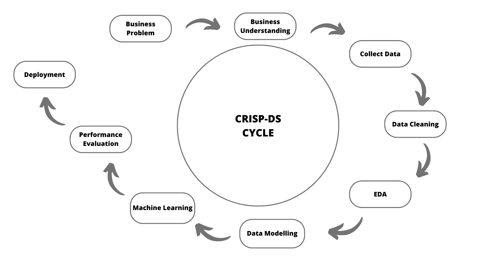

1. Data Description: understanding of the status of the database and dealing with missing values properly. Basic statistics metrics furnish an overview of the data.
2. Feature Engineering: derivation of new attributes based on the original variables aiming to better describe the phenomenon that will be modeled, and to supply interesting attributes for the Exploratory Data Analysis.
3. Feature Filtering: filtering of records and selection of attributes that do not contain information for modeling or that do not match the scope of the business problem.
4. Exploratory Data Analysis (EDA): exploration of the data searching for insights and seeking to understand the impact of each variable on the upcoming machine learning modeling.
5. Data Preparation: preprocessing stage required prior to the machine learning modeling step.
6. Feature Selection: selection of the most significant attributes for training the model.
7. Machine Learning Modeling: implementation of a few algorithms appropriate to the task at hand. In this case, models befitting the regression assignment - i.e., forecasting a continuous value, namely sales.
8. Hyperparameter Fine Tuning: search for the best values for each of the parameters of the best performing model(s) selected from the previous step.
9. Statistical Error Analysis: conversion of the performance metrics of the Machine Learning model to a more tangible business result.
10. Production Deployment: deployment of the model in a cloud environment (Render), using Flask connected to our model in a pickle file.

## 4.3 Final Product

- Telegram bot acesssed by API

# 5. EDA & Insights

## 5.1 Mindmap Hypothesis

This step is important to look for insights that will help find the best solution.

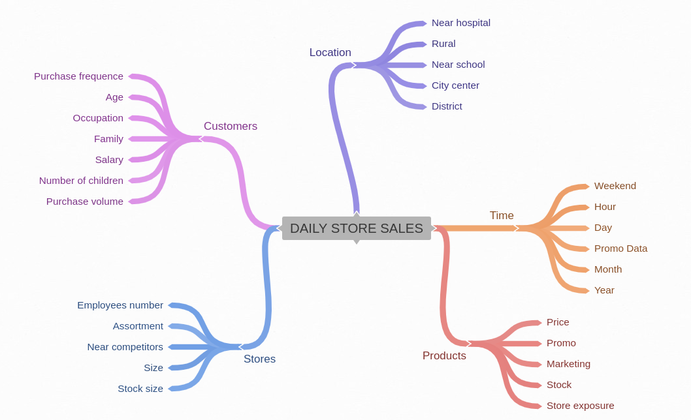

## 5.2 Numerical Attributes Correlation

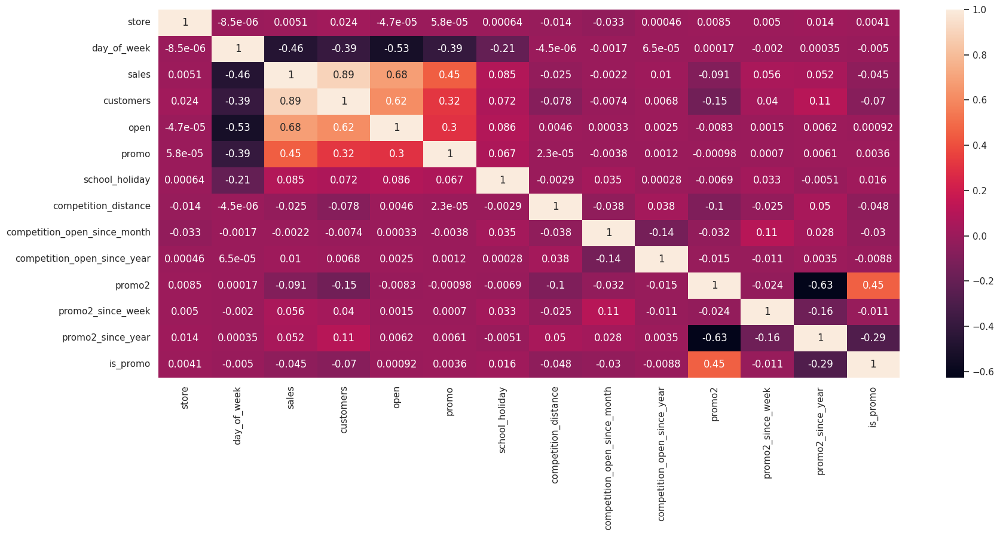

## 5.3 Categorical Attributes Correlation

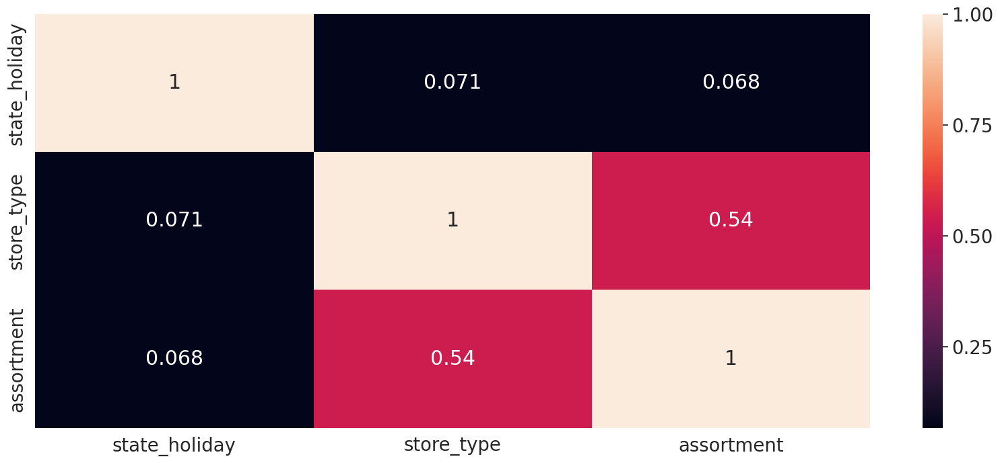

## 5.4 Main Hypothesis

Here, the criterion used to choose the main hypotheses was in the sense of how shocking and impacting the result would be for the business team's beliefs.

Hypothesis 1 (H2 in notebook): Stores with closer competitors should sell less. False: Data showed us that, actually, they sell MORE.

Business team's belief revealed us their thoughts on lower sales while drugstores are closer to the competitors. This hypothesis proves the opposite The correlation analysis of "competition distance" and "sales" shows a small correlation, indicating that sales do not increase when competitors are closer.

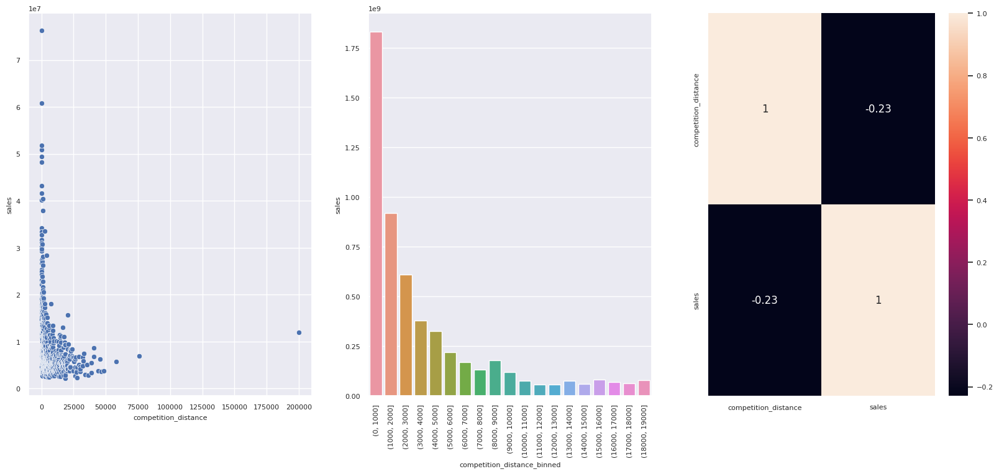

Hypothesis 2 (H4 in notebook): Stores with longer active offers should sell more. False: Data showed us that, stores that kept products on sale for a long time performed worse than before.

Again, we shocked business team's belief and common sense that. Here are the visualizations.

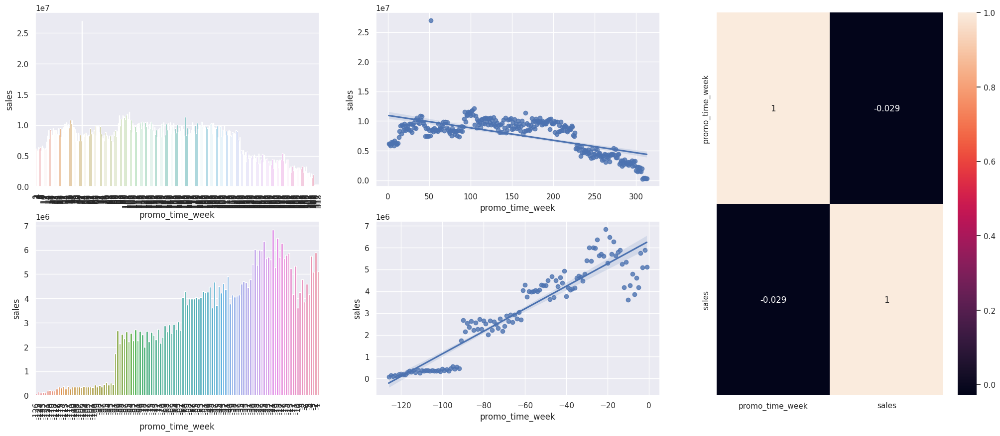

Hypothesis 3 (H10 in notebook): Stores should sell more after the 10th day of each month.
True: the average performance is better after 10 days of the month.

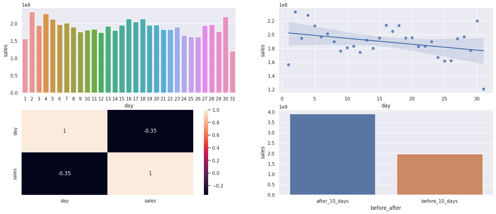

# 6. Machine Learning Model

A total of five models were tested and we get the performance bellow:

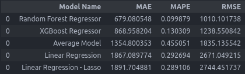

To calculated real performance, Cross Validation methos was used.

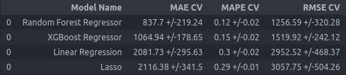

Note the Random Forest is slightly better than XGBoost Regressor, but the model chosen was XGBoost. The reason for this is simple, Random Forest generated a much larger model and for now the gain in memory use is better than a slightly increase in performance.

Implementing the hyperparameter tunning through the Random Search we get a better performance:

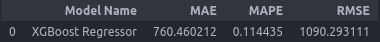

# 7. Business Performance

According to our forecasting model, we achieved an efficiency improvement compared to previous forecasts (Average Model had 1354.8 for MAE and our new model has 760.46). Translating into business terms, we calculate the sum of worst and best revenue scenarios, and the respective forecasts made.

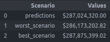

# 8. Conclusion

- XGBoostRegressor model had the best performance when it comes to **Results/Time  Accuracy**, and thus gave us a more assertive prediction, helping our CFO on taking futures decisions about budget and repairing the stores.

# 9. Deployment

Go say 'Hi' to our bot!

- Sign up in Telegram;
- Submit one number at a time and wait for prediction!
- or just look for 'datarossmann_bot' in Telegram's search!